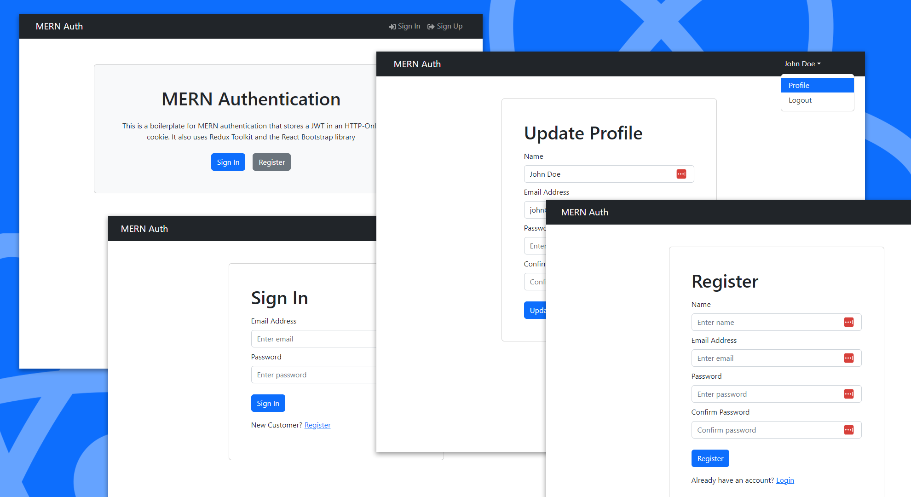

# Full Stack Authentication Starter

This is a starter app for a full stack application with authentication.



Main Stack:

- NodeJS with Express & MongoDB
- JWT Auth
- React
- React Bootstrap
- React Toastify

Implementations:

- Backend API with Express & MongoDB
- Routes for authentication, logout, register, profile, update profile
- JWT authentication stored in HTTP-only cookie
- Protected routes and endpoints
- Custom middleware to check JSON web token and store in cookie
- Custom error middleware
- React frontend to register, login, logout, view profile, update profile
- React Bootstrap UI library
- React Toastify notifications

## Usage

- Create a MongoDB database and obtain your `MongoDB URI` - [MongoDB Atlas](https://www.mongodb.com/cloud/atlas/register)

### Env Variables

Rename the `.env.example` file to `.env` and add the following

```
NODE_ENV=development
PORT=5000
MONGO_URI=YOUR MONGO URI
JWT_SECRET=YOUR JWT_SECRET
```

Change the JWT_SECRET to what you want

### Install Dependencies (frontend & backend)

```
npm install
cd frontend
npm install
```

### Run

```

# Run frontend (:3000) & backend (:5000)
npm run dev

# Run backend only
npm run server
```

## Build & Deploy

```
# Create frontend prod build
cd frontend
npm run build
```
